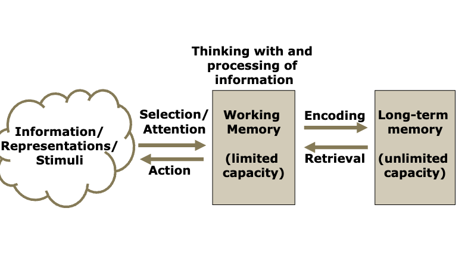
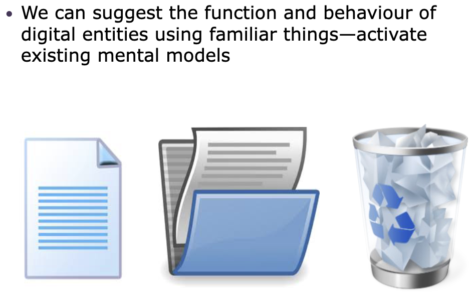
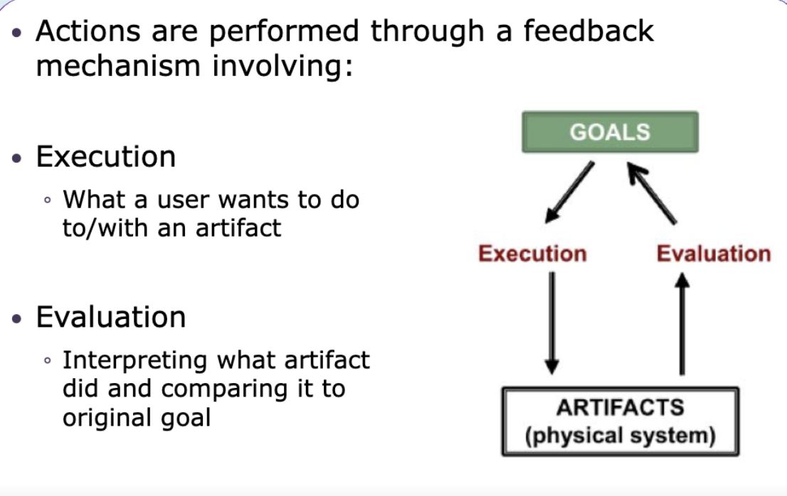
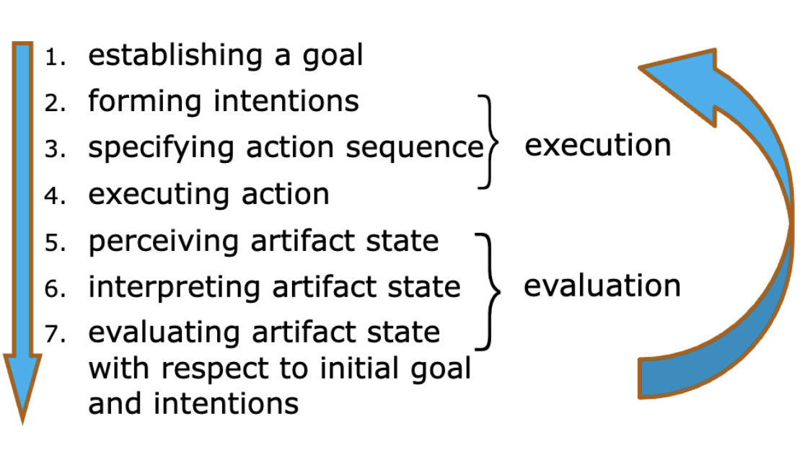
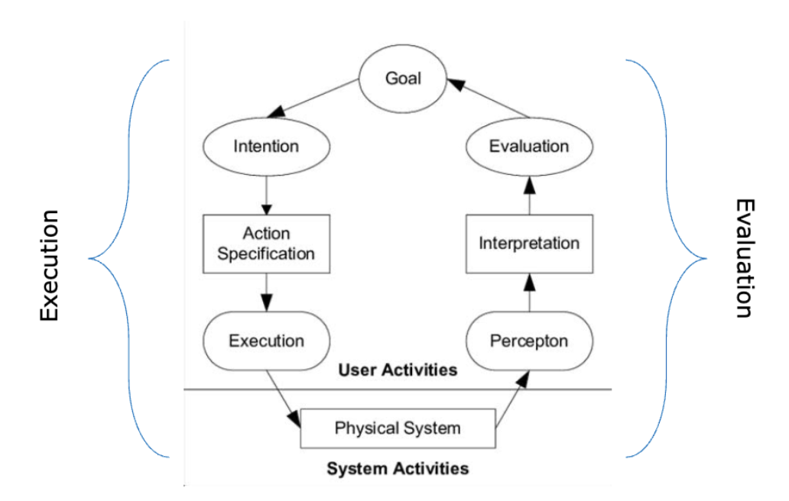
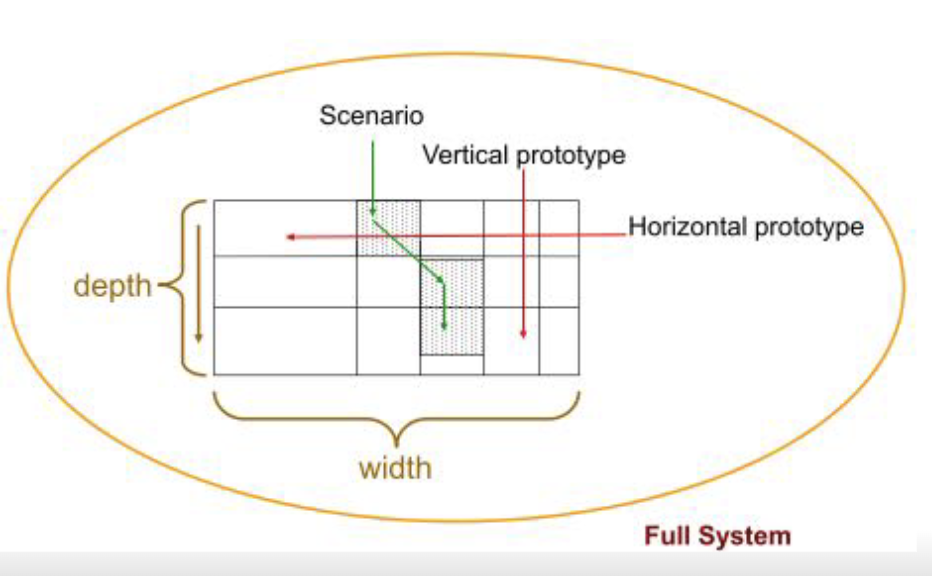

# 3.  Modeling

## 3.1 What is a model

- A representation or approximation of some system.

- Physical / Non-physical 

### Model Fidelity

Model的准确性。

📝 A measure of the **accuracy and precision** of the correspondence between the model and the modeled

## 3.2 Modeling Cognition

Cognition就是“to think”

### Process

1. Perception: acquire information
2. Attention: select things to focus
3. Memory: store and recall information 

### Modes of Coginition

#### 1. 种类

记住这两条！！！

1. **Experimental / Automatic**
   - Promotes shallowness of cognitive
   - automatic and easy 条件反射类型
2. **Reflective / Controlled**
   - Promotes depth of congnitive
   - require mental effort 需要特别反应

#### 2. offloading

-  **High cognitive offloading**

  **much** of the effort is **offloaded** onto the external **system**

-  **Low cognitive offloading**

   **much** of the effort is required by the **user** to perform a given activity

#### 3. Distributed Cognition

>  Mental tasks do not occur solely in the head. 
>
> They are `distributed`. We think in **<u>partnership</u>** with `external artifacts`—both static and interactive ones

👉 Cognitive Coupling:  When we engage with any system, a coupling is created

🍰： Proper coupling means creating systems that **fit the cognitive system** of user

- Weak / Strong coupling. 

  Weak: Passive被动的 observation of a book

  Strong: Interactive engagament with material

### 3.3 Modeling Cognition - Design Principles 

#### 1. Attention

- Users often focus attention only on what is necessary. 

> Designers need to think about the **<u>layout of objects</u>** in the context of the <u>**user’s tasks**</u>

#### 2. Change Blindness

>
> People <u>**do not notice**</u> differences in features <u>other than those that their goals require</u> them to pay attention to.

#### 3. Working Memory

> System should **help people remember essential information** from one moment to the next
>
> 不要让用户自己记着

## 3.4 Conceptual models

### 1.  What is mental model?

> The model people have of all kinds of systems/entities and their behaviours
>
> 人们对生活里所有见到的东西产生的印象

Mental models serve as a basis and starting point for **3 key things**:

1. How we **simplify complexity**
2. Why we consider **<u>some things more relevant</u>** than others

3. How we **<u>reason through a challenge</u>** or problem and solution

> 💡 When users encounter a new product, they **<u>draw on their existing mental models</u>** to try to understand it.

**`Familiarity`**: **<u>Our familiarity with forms and behaviours</u>** in our environment determines **<u>which mental models are activated</u>**

**`Dynamic`**:  Users are moving targets. However,  **given the right assistance,** users can learn to use unfamiliar tools

### 2.  Concenptual Models

> The model that a system conveys so that people **<u>mentally simulate its operation</u>** and behaviour based on its **<u>visible parts and the implications of the properties</u>** and relations of these parts

> 1. **<u>conveys</u>** a model of how something conceptually works
> 2. you mentally **<u>simulate</u>** its operation
> 3.  parts are **<u>visible</u>** and **<u>implications</u>** are clear

#### Conceptual Model在computer systems 和其他物品上有什么difference?

Computer systems usually have **many of the parts** and **implications hidden** from users!

## 3.5 Modeling Activities

### 1. Designer's mental model

Designs are **hypotheses** about how users think 自己假设

Goal: **Alignment and coupling**

- proper alignment of the **<u>user’s mental model and the designer’s mental model</u>**
- 这样才有 **<u>system model and the user’s mental model</u>**
- 使用UCD strategies

### 2. Gulfs

#### Execution and Evaluation 

> 2 gulfs
>
> 1. `Gulf of Execution`
>
>    What the systerm allow the user to do :left_right_arrow: What the user believes he can do
>
> 2. `Gulf of Evaluation`
>
>     What the system intends to convey :left_right_arrow: what the user perceives
>
>    

How do users perform tasks?

1. **User** has a **goal**, residing in the mind
2. **Task** is carried out with **physical system**
3. **User** must **interpret** (make sense of) system
4. **Goals** are **expressed** in terms relevant to the user
5. **System’s states** and mechanisms are expressed relative to the system

**<u>简单说就是Execution和Evaluation</u>**

#### Bridging the gulfs

1. **Designer** can bridge the gulfs

   <u>Construct input/output characteristics</u> of artifact’s interface to make better matches to
   psychological needs of user

2. **User** can bridge the gulfs

   Create <u>plans, action sequences, and interpretations</u> to move his/her intentions <u>closer to the goals/requirements of the artifact</u>

### 3.  Action Cycle

|                                                              |                                                              |
| ------------------------------------------------------------ | ------------------------------------------------------------ |
|  |  |

### 4. Practical Implication（含义）

“**How well they support different stages of user activity **”

1. **Designers** provide <u>a good conceptual model</u> for users to understand
2. **User** must <u>translate goals</u> conceived in <u>psychological terms</u> to <u>artifact-suitable</u> action

Interface is understood through either **proper design** or training/experience.

✨ Ideal situation 就是<u>不需要让user learning来bridge gulfs</u>

> :lollipop: Aided by a good conceptual model

## 3.6 Modeling HCI artifacts through prototyping

>  Software prototypes are **<u>concrete models of an incomplete design</u>** for testing design ideas

### 1. Fidelity of Prototypes

- **High fidelity**
  -  Fidelity is **close to the final HCI artifact**
  -  e.g., a real interactive application containing mock data
-  **Low fidelity**
  - Fidelity is **far from the final HCI artifact**
  -  e.g., a set of sketches of screenshots that are presented to a test user in sequence to mimic look and interaction

### 2. Prototyping methods

- ***Rapid or throw-away*** :  Based on trial-and-error. 

  🌟 allows for **frequent feedback** and open **dialogue between users and designers**

  <u>Allows for easy trial of idea.</u>

  Emphasis on <u>evaluating</u> the prototype before discarding <u>in favor of other prototypes</u>

- ***Evolutionary or organic***: Based on biological phenomena. 

  🌟 most often!!!!! more natural

  Design is <u>emergent</u>

  <u>Bottom-up</u> design

  Designer constantly learns from design

  <u>Compromise</u> between design and implementation

- ***Modular***: Based on mechanistic phenomena.

  Build <u>one section at a time</u>.

   Based on one overall master design

  <u>Highly modular</u>

  Pieces are bolted on to produce system gradually

   Promotes <u>top-down</u> design

### 3. Prototype Functionality

- Horizontal

  Broad and shallow

  Overview with limited underlying functionality

- Vertical

  In-depth functionality for a few selected features

  High- and low-level functionality for some restricted portion of the system

- Scenario-based

  particular fixed uses of the system

