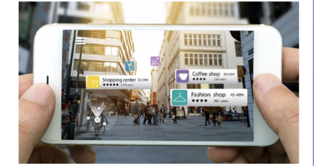

# 6. Importance of Interaction

## 1. The basics

### What is Interaction

Interaction can be divided into `action` and `reaction`

- Action is preformed on UI
- Reaction is UI changes

### Initiator of interaction

1. Reactive 

   系统被动

   system is passive被动的 and wait for action before reaction.

2. Proactive 

   系统主动我被动

   System is active and users reacts(比如notifications )

3. Mutual or mixed -intiactive

   System and user can both initiate interaction or wait to react to other party

## 2. Interaction Basics

#### archetypal原型 interactions

1. Manipulating 用手做

   hands reaching UI

2. Navigating

   Walking in map in game

3. Conversing 用嘴说

   commands, text menus

4. Transmitting 感受

   User sending/receiving transmissions to and from the system

## 3. Levels of Interaction

#### Interaction has 2 aspects

- Ontological: What is interaction
- Operational: How is interaction performed

1. Physical interaction: mouse clicking
2. Abstract interaction

### Levels

| Events level                | Action level                               | Tasks Level                | Activities Level                  |
| --------------------------- | ------------------------------------------ | -------------------------- | --------------------------------- |
|   | 由多个events组成 |  |         |
| Dragging, clicking, swiping | cut/paste                                  | writing a document         | Problem solving / decision making |

### Micro/macro level interaction 

`Micro`: act upon the individual entities in system用户在界面上进行的 **瞬时、具体的操作**，是 **单一、细小的交互行为**。

- Anotating: highlight in ebook/...
- Arranging: Change the order of entities
- Drilling: Right click something to look for more info
- Transforming: Change geometric 图形form of entities

`Macro`: emerges as the larger trajectory of action. 由多个micro组成，具有 **整体目的和长远结果** 的交互过程。

- **Diversity of micro-level interactions**

  The variety and number of interactions available, enabling users to perform different cognitive tasks

- **Complementarity of micro-level interactions**

  How well interactions work together, supporting coordinated and integrated cognitive activities

- **Flexibility of interactions** 

  The ability to adjust interface properties to meet user needs, enhancing personalization and usability.

## 4. Interface Styles

- **Command-based** interfaces （比如控制台）

- **WIMP** : mimc human behaviour but can desorient users when too many windows

  

- **Direct manipulation:** use hand and pointing device

  Hard to record history

- **3D** interface

  not easy to program

- **Natural language / Speech** interfaces：语音控制

  - Pro: relieve burdun of learning syntax
  - Cons: 需要clarification dialog

- **Multi-touch interface** 多人触控的触控屏

  - Pro: Flexibility & C ollaborative
  - cons: 多指操作有误

- **Haptic Interfaces** force/vibration feedback

  - 比如手柄震动
  - Pro: make all kinds of sensory illusions possible
  - Cons: need more hardware

- **Gaze-based interfaces** 眼神追踪

  - Eye tracking
  - Can be very effective for disabled people 

- **Olfactory interfaces** 气味feedback

  - the least developed area
  - VR/AR的普及，可以做气味感受

- **Gesture Interfaces** 屏幕上的不同首饰的指令

  - Pro: may feel natural and efficient 
  - Cons: require learning gestures

- **Holographic interface** 全息影像

  - create a 3D image of an object with which the user can interact
  - do not require special glasses!!! 裸眼才叫全息影像

- **Virtual reality Interfaces**  VR生成3D虚拟环境

  - Require special equipment 

- **Augmented Reality Interfaces**

  superimpose叠加 information on the world we see

  

- **Brain-computer or neural interfaces**

  - 向external devices传送brain signals

