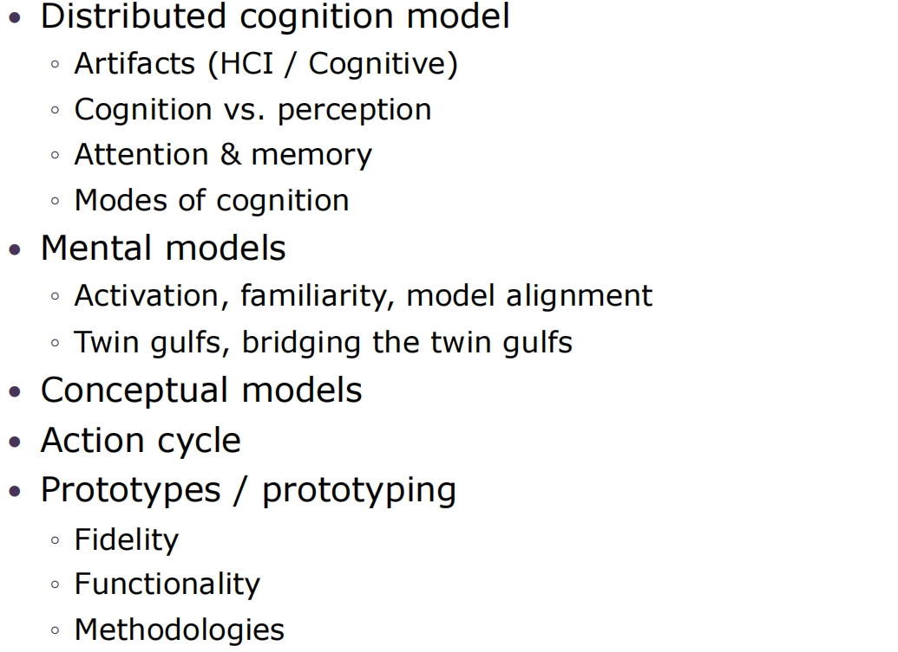

# **Lecture 10 - Course Overview**

## **1.HCI Framework**

  

> 四大组成部分：people, technologies, design, activities & contexts. (See Lecture1)

## **2.Design / Design Thinking**

See 1, Lecture2

## **3.Modeling: Cognition, Activity, Prototyping**

  

See Lecture 3

## **4.Semiotics & Representations**

Components

- Sign
- Interpreter
- Meaning
- Context

Types of signs

- Iconic
- Indexical
- Symbolic

See Lecture5

## **5.Cognitive Design: Design Principles**

  

See Lecture4

## **6.Interaction & Interface Styles**

  

See Lecture 6

## **7.Analogies & Metaphors in Design**

Factors of valid metaphor(see 1.4, Lecture7)

- structure
- applicability
- representability
- suitability
- extensibility

## **8.Design Language**

See 3, Lecture7

## **9.Interactivity**

  

See Lecture8

## **10.Evaluation**

Goals

- Usability
- User Experience

Two broad approaches

- Analytical (Heuristics & Cognitive Walkthroughs)
- Empirical (Observational, Experimental)

See Lecture9

>***写在最后***
>
> 哦，我亲爱的老朋友们，这真是一个令人愉快的合作！我真不敢相信我们复习完所有的HCI内容这件事就这样发生了，我发誓这门课听起来并不是那么的津津有味。然而这里是我们所在的地方，就是这样。
> 
> 我恐怕得说，总结所有标题杂乱的演示文稿的内容是一件不简单的事情。但是我们完成得很不错，不是吗？看在上帝的份上，我必须需要好好用一首打油诗总结一下我们的工作。否则我将不得不遗憾地告诉大家，我想踢人的旧靴子会失控的！
>
> 诗曰：
>
> "设计思维引方向，
认知模型筑基梁。
>
> 符号表征传意志，
界面交互显辉煌。
>
> 类比隐喻如桥渡，
语言设计显真章。
>
> 评估改进求精良，
人机共处景无疆。"
>
>
> 我们不知为何齐聚于这门HCI的课上，一路回想过来，这门内容繁杂的课就像整个冬季学期的线索一样，将三个月无数苦涩、美好、疲惫、憧憬的时刻穿织在一起。转瞬之间，我们已经迎来了Sedig教授HCI故事的尾声，时间能无情地磨灭一切事物，希望这些文字能些许保留我们对于这段时间的记忆。
>
> 又曰：
>
> "冬雪拂面课程开，
十篇总结迎面来。
>
> 项目提议被淘汰，
期中考试惨落败。
>
> 列表章节显能耐，
广告暂停真不赖。
>
> 希克泰姆实力派，
期末答卷流光采！"

