# **Lecture 4 - Design Principles**

## **0.What are Design Principles?**

> *"Many people did not even know the basic design principles on which your projects are based!!!"* ***(K.Sedig, 01/03/2025)*** 👉🐯 😞😭

- Widely applicable laws

- Guidelines

- Biases

- Design considerations

- Professionals from many disciplines—e.g., behavioral science, sociology, physics and ergonomics. 

> *"集百家之长，成一家之言。"* 
> 
> 各路人才汇聚于此造就 Design Principles。

## **1.Gestalt Principles**

> **"Unified Whole"** — People tend to focus on the sum of all parts. 在视觉方面让用户知道哪些元素是一个整体，哪些元素独立且不同。

- **Similarity**: items which share a ***<u>visual characteristic</u>*** are perceived as more related than items that are dissimilar.

> 视觉上相似的东西是有关的（颜色往往强于形状）。

  

- **Proximity**: Elements that are ***<u>near each other</u>*** are perceived as related.

> 位置相近的东西是有关的。

  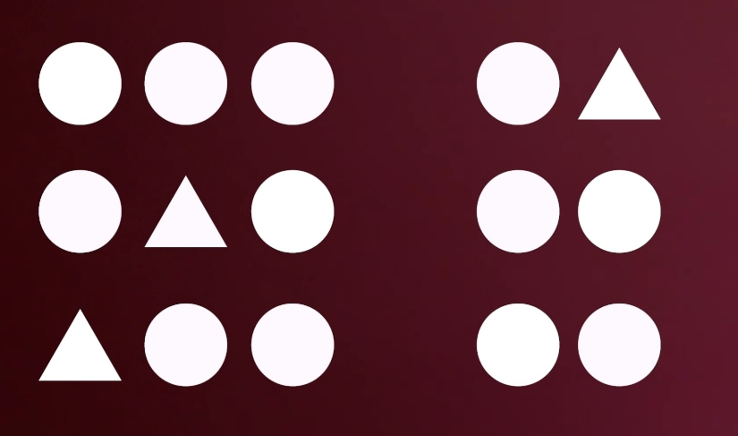

- **Closure**: People will ***<u>fill in blanks</u>*** to perceive a complete object whenever an external stimulus partially matches that object. 

> 脑补的过程，见微知著。

> *"从一粒细沙看见世界，从一朵野花窥视天辰。*
> 
> *用一只手去把握无限，用一刹那来留住永恒。"* ***—William Blake***

  

- **Connectedness**: Elements ***<u>connected to each other</u>*** are perceived as part of the same unit.

> 连接着的东西被视为一个整体（连接往往强于位置和相似）。

  

- **Common Fate**: Objects that are ***<u>synchronized in movement</u>*** are likely to be grouped as one.

> 一起运动的东西被视为一个整体。

  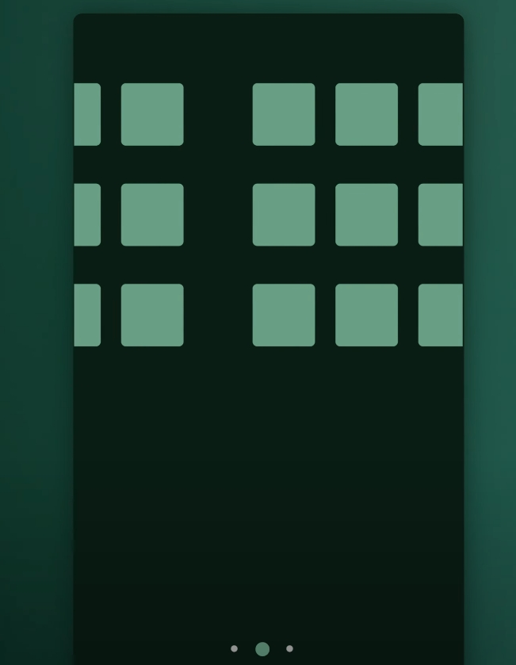

- **Continuation**: Eyes tend to follow ***<u>visual paths and sequences in order</u>*** to identify relationships between designed elements.

> 路径和序列代表关系。

  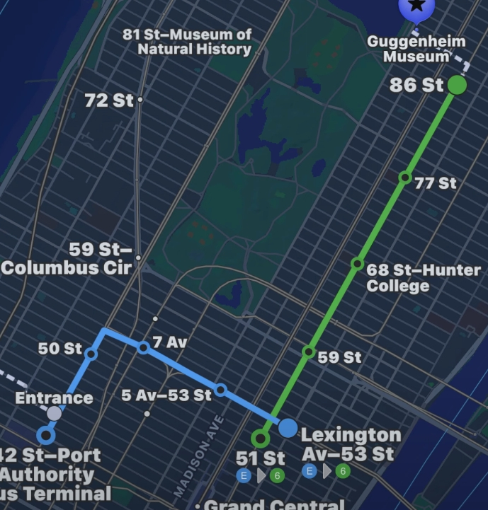

- **Figure/Ground**: People instinctively see objects as figure and ground, where "figure" represents an obejct of focus in the ***<u>foreground</u>*** while "ground" represents the ***<u>background</u>***.

> 区分前景和背景来制造交互欲。

  

- **Common Region**: Items ***<u>within a boundary</u>*** are perceived as a group and assumed to share some common characteristic or functionality. 
 
> 被包裹着的东西被视为一个整体。

  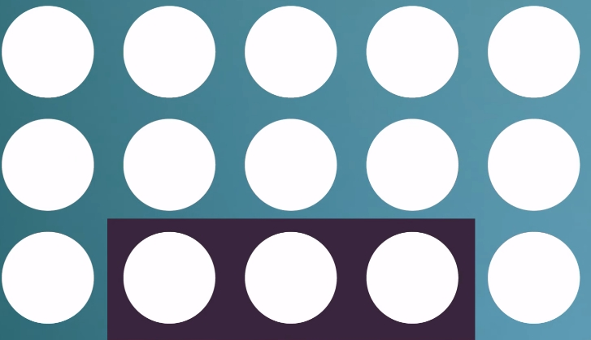

## **2.Knowledge in the World(Externalization of Information)**

**Definition**: "Knowledge in the world refers to the information that is ***<u>available in the environment, external to the person</u>***. It includes labels, signs, physical constraints, and cultural conventions that guide behavior ***<u>without requiring memorization</u>***. Good design puts the required knowledge in the world, making it easy for people to know what to do simply by looking at the system or object." ***—Donald A. Norman, The Design of Everyday Things (Revised Edition, 2013)***

> 信息来源于环境（Knowledge in the World），而不是大脑中的记忆(Knowledge in the Head)使得事物更加容易理解。
>
> *"打败Boss就应该用绝望中摔倒后在地上随手摸到的搬砖或者榴弹炮。"*

## **3.Visibility**

**Definition**: "All necessary actions and system statuses should be ***<u>clearly visible</u>*** to users, ***<u>without requiring them to recall</u>*** information from memory or guess how to proceed." ***—Donald A. Norman, The Design of Everyday Things (Revised Edition, 2013)***

> 视觉外观应该映射交互方式。
> 
> *"小样儿，你穿上马甲我还真不认识你啦！"* 😕

- **Difference between Visibility and Gulfs**: Visibility must be ***<u>sensible, non-arbitrary, and meaningful.</u>***

## **4.Affordance**

**Definition**: "the term affordance refers to the perceived and ***<u>actual properties</u>*** of the thing, primarily those ***<u>fundamental properties</u>*** that determine just ***<u>how the thing could possibly be used.</u>***" ***—Donald A. Norman, The Psychology of Everyday Things (Original Edition, 1988)***

> 物体的属性和交互对象的能力间的关系。

  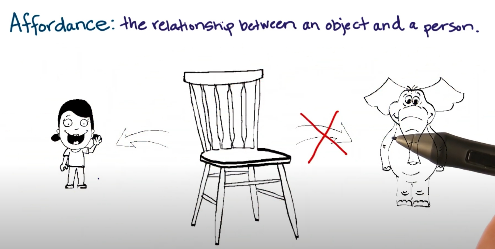

## **5.Familiarity**

**Definition**: "The principle of familiarity states the importance of using ***<u>familiar concepts and metaphors</u>*** in the design of a human-computer interface. Try using patterns that ***<u>people are already familiar with</u>***  to achieve intuitiveness." ***—Nick Babich, Human Factor Principles in UX Design***

> 使系统符合用户使用类似产品的先验知识，来减少使用系统的学习成本。

## **6.Skeuomorphism(拟物主义)**

**Definition**: "Skeuomorphism is a design practice incorporating ***<u>real-world elements</u>*** into digital interfaces to create a sense of familiarity with new interfaces." ***—Megan Chan, Skeuomorphism(2024)***

> 通过视觉模仿真实物体的设计风格，来减少使用系统的学习成本。
> 
> 不同于Familiarity对于类似产品的惯例认知，更加依赖用户对于现实世界物体的认知。

## **7.Constraints**

**Definition**: "Constraints are powerful clues, ***<u>limiting the set of possible actions</u>*** , in order to let people readily determine the proper course of action, even in a novel situation" ***—Donald A. Norman, The Design of Everyday Things (Revised Edition, 2013)***

> 通过各种手段的限制来防止错误操作并优化用户体验
>
> *"天将降大任于斯人也，必先灭其微信，封其微博，收其电脑，夺其手机，摔其iPad，断其WIFI，剪其网线，砸其电视......,使其百无聊赖"*

  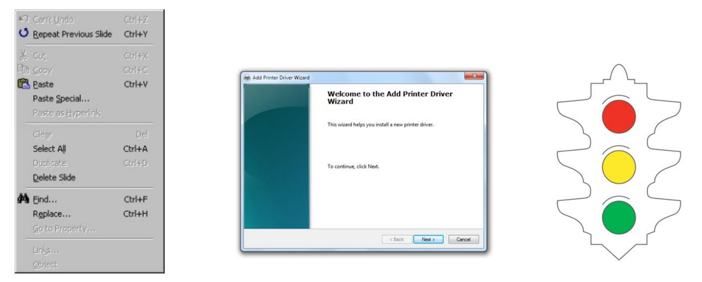

## **8.80/20 (Pareto) Rule**

**Definition**: "The Pareto principle (80/20 rule) states that for many outcomes, roughly 80% of consequences come from 20% of causes" ***—Wikipedia, Pareto principle***

> 最小成本实现最大效益。

  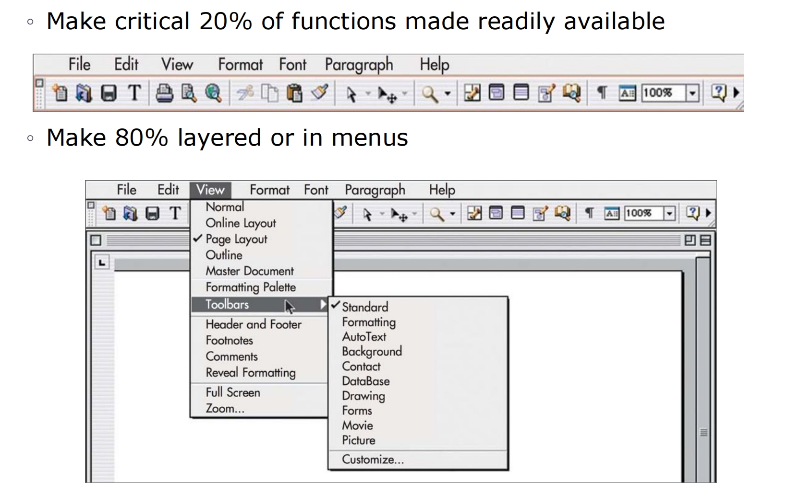

## **9.Flexibility-usability Tradeoff**

**Definition**: "Flexibility-Usability Tradeoff states that as the ***<u>flexibility</u>*** of a system ***<u>increases</u>***, its ***<u>usability decreases</u>***." ***—Wikipedia, Flexibility–usability tradeoff***

> 灵活性和可用性，二者不可得兼。

  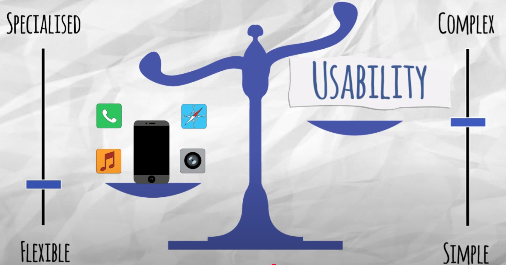

  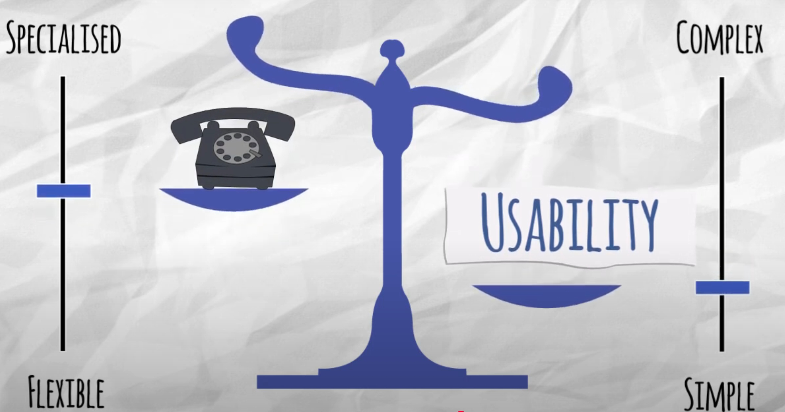

## **10.Chunking**

**Definition**: "Chunking is a concept that originates from the field of cognitive psychology. UX professionals can ***<u>break their text and multimedia content into smaller chunks</u>*** to help users process, understand, and remember it better" ***—Nielsen-Norman group, THow Chunking Helps Content Processing (2016)***

> 将复杂信息拆分成小块(Chunk), 来降低用户认知符合。

## **11.Mapping**

**Definition**: "Mapping refers to the relationship between ***<u>controls</u>*** and the ***<u>results</u>*** they produce." ***—Donald A. Norman, The Design of Everyday Things (Revised Edition, 2013)***

> 用户操作与系统反馈间的关系。这种关系应当明确。

  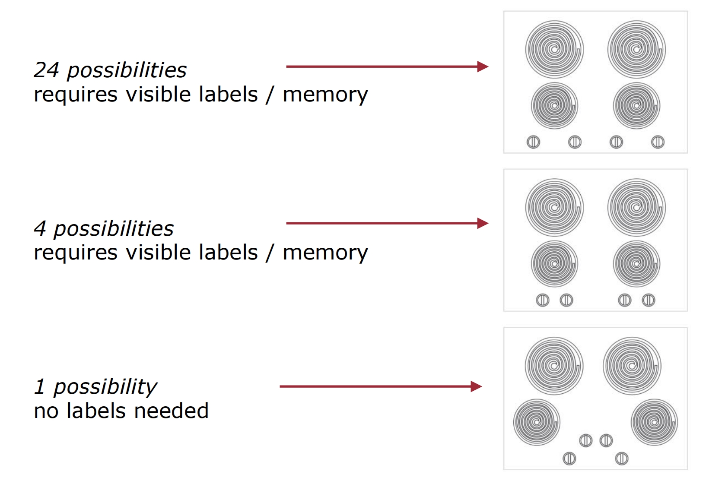

## **12.Fitts’ Law**

**Definition**: "Fitts’ law states that the amount of ***<u>time required</u>*** for a person to ***<u>move a pointer</u>*** (e.g., mouse cursor) to a target area is a function of the distance to the target divided by the size of the target." ***—Interaction Design Foundation, What is Fitts’ Law?***

> 为了用户点得快又准，目标就要大且近。

## **13.Hick’s Law**

**Definition**: "Hick’s Law states that the ***<u>more choices</u>*** a person is presented with, the ***<u>longer the person will take</u>***  to reach a decision." ***—Interaction Design Foundation, What is Hick’s Law?***

> 为了减少用户决策时间，减少选项。

## **14.Progressive Disclosure**

**Definition**: Progressive disclosure is an interaction design technique that ***<u>sequences information</u>*** and actions across several screens in order to ***<u>reduce feelings of overwhelm</u>*** for the user. ***—Spillers (2004)***

> 不一口气展示所有东西，按需逐步呈现。
>
> *"心急吃不着热面皮，我来助你循循而进。"*

## **15.Consistency**

**Definition**: "Consistency is the usability of a system is improved when ***<u>similar parts are expressed in similar ways.</u>***" ***—William Lidwell, Kritina Holden, and Jill Butler, Universal Principles of Design***

> 产品的不同部分间保持统一的交互模式。

## **16.Transfer**

**Definition**: "The process and the effective extent to which ***<u>past experiences</u>*** (transfer source) affect learning and performance in a ***<u>current novel situation (transfer)</u>***" 

- **Negative**: Prior experience causes errors in new systems.
  
> 老用户不友好，老古董里的操作，在新家伙中有着不同甚至相反的反馈。
>
> *"工欲善其事，必先利其器。形形色色花里胡哨的IDE，不如Emacs老当益壮！"* ***—wx672***

- **Zero**: Prior experience helps nothing in a novel system.

> 在一片全新的土地上，旧经验尽数失效，用户体验之路何去何从。
>
> *"I can safely said no body understands quantum theory."* ***—Dirac***

- **Positive**: Prior experience helps users adapt faster.

> 老用户友好，老古董里的操作，在这些新家伙中使用自如。

## **17.Garbage in, Garbage out**

**Definition**: "Garbage in, garbage out(GIGO) refers to the idea that in any system, the ***<u>quality of output</u>*** is determined by the ***<u>quality of the input</u>***." ***—Rahul Awati, Definition
Garbage in, garbage out (GIGO)***

> 糟糕的输入必然导致糟糕的输出。增加容错，减少错误机会来增强用户体验。

  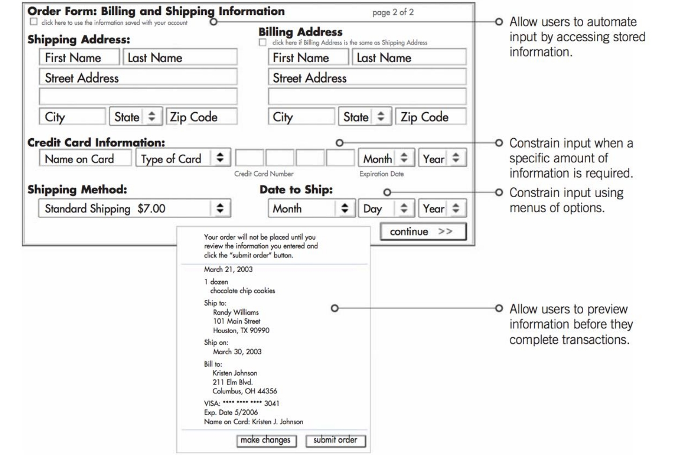

## **18.Control**

**Definition**: "Control emphasizes that users should always ***<u>feel in command</u>*** of a system’s behavior, rather than being ***<u>forced into rigid workflows</u>***. Effective control enhances trust, efficiency, and satisfaction."

> 是用户在使用系统，而不是系统在主导用户。用户对系统有足够的控制。

  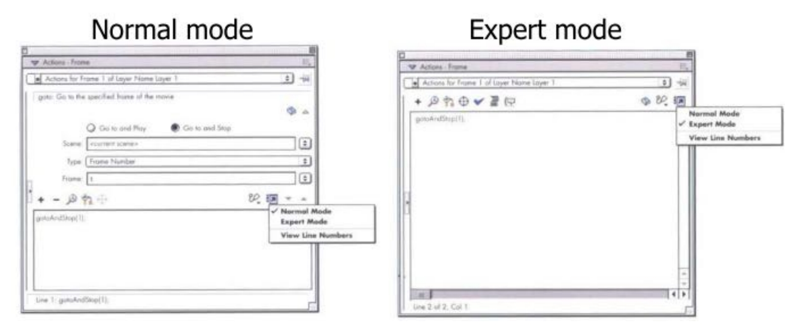

## **19.Feedback**

**Definition**: "Feedback is a vital ***<u>communication channel</u>*** between users and the systems or interfaces they interact with. It enables users to ***<u>understand the consequences of their actions</u>***, provides reassurance, and helps guide their decision-making process." ***—Donald A. Norman, The Design of Everyday Things (Revised Edition, 2013)***

> 每一次交互都有明确的回应。

  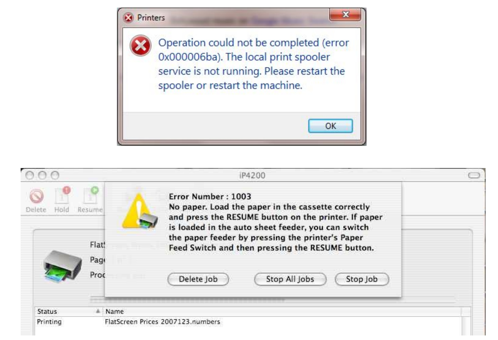

## **20.Multitasking**

**Definition**: "Multitasking refers to a ***<u>user's ability to handle multiple tasks or information streams simultaneously</u>***. Interaction design must ***<u>balance</u>*** users' multitasking needs with cognitive load to enable efficient and low-friction parallel experiences."

> 让用户在不同任务间无缝切换，避免迷失和过载。

## **21.Causality**

**Definition**: Causality focuses on the clear ***<u>connection between user actions and system responses</u>***. This principle emphasizes that systems should ***<u>react to user operations</u>*** in ways that are understandable and predictable.

> 为了强调因果关系操作和结果，在时间上避免延迟，在视觉上添加动画或过渡。
>
> *"一粒金丹一因果，我命由天不由我。"*

## **Summary**

This Lecture illustrates 21 design principles in terms of HCI.

> *"三七皆用，难满功成。"*