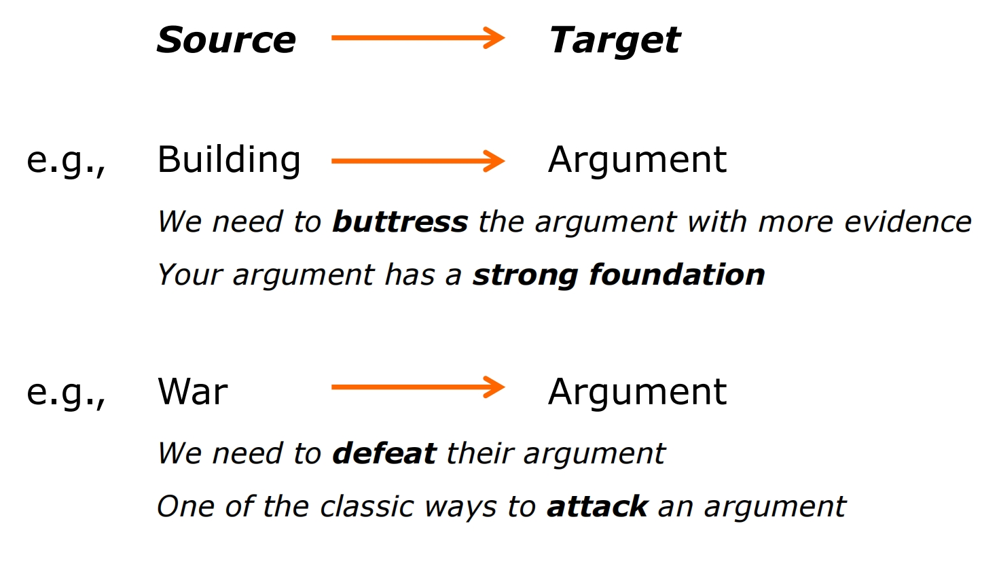
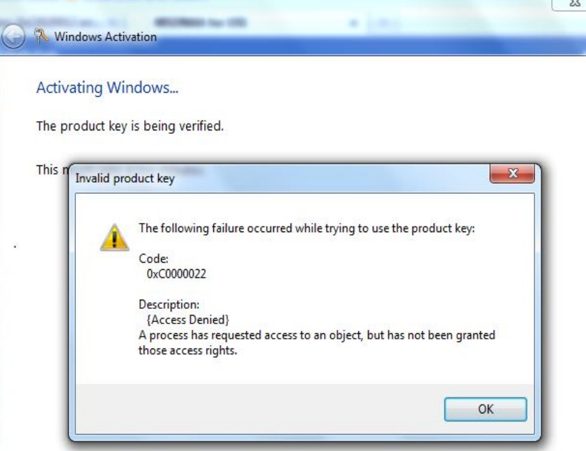

# **Lecture 7 - Metaphors, Domain of Experience, and Design Language**

## **1. Metaphors**

### 1.1 Introduction to Metaphors

**Definition**: "A metaphor is a figure of speech that, for rhetorical effect, directly ***<u>refers to one thing by mentioning another</u>***. It may provide (or obscure) clarity or identify hidden similarities between two different ideas. Metaphors are usually meant to create a likeness or an analogy." ***—Wikipedia, Metaphor***

- Metaphors and Analogies.

> 隐喻(Metaphors)和类比(Analogies)有什么不同？
>
> 类比是两个实体之间感知到的相似性，隐喻是表达这种相似性的修辞手法。类比关乎于表达的内容，隐喻更着重表达的方式。

> ***学后闲谈：Metaphor and Affordance*** 
> 
> 我发现Metaphor还经常被拿出来与Affordance（详见Lecture4_4）一起说道。“一个是方法，一个是属性。或者说，一个是对设计方法的描述，一个是对设计产出物本身的描述”是我看到的一句较为精辟的解释。
>
> 在设计之初，设计者们都希望最终产品有一个非常好的Affordance属性，因为这是一个设计原则。为了达成这个目的，设计者们用了诸多方法，Metaphor就是方法之一。
>
> 对于Metaphor的使用，可能会带来两种截然不同的Affordance属性。举一个HCI领域非常经典的例子：将保存的按钮绘制成软盘💾的样子。这样的Metaphor对于认识软盘并且宝刀未老的人来说明显有着很强的Affordance属性，但是对于那些出生在或许21世纪的小朋友来说也许效果恰恰相反。也许你当着他们的面拿出一个软盘，他们会睁圆大大的眼睛，认为你3D打印了保存按钮的图标。
>
> 一件物品也许有着非常优秀的Affordance属性，但是没有用到Metaphor。设计者用了Metaphor的方法，也许也会导致非常差的Affordance属性。
>
> 他们俩啊，就像若即若离的阴和阳一样，亲密无间又貌合神离。

- A metaphor is a <u>mapping</u> from one system/domain 
to another

  

- Metaphors function as <u>natural 
models.</u>

> 这个model允许我们利用熟悉具体的事物，对陌生抽象的事物提供结构。

- Metaphor and skeuomorphism.

> 我理解它相似于饭后闲谈里的Affordance，Metaphor是达成Skeuomorphism的一种手段。

- Why care about Metaphors?
    - Metaphors are closely linked to conceptual models(See 3.4, Lecture3)
    - Metaphors help reduce complexity by highlighting what we should pay attention and what to suppress.

> Metaphor可以是一种让用户理解Conceptual Model的方法。

### 1.2 Metaphors in Computing History

- Computer as <u>vast library</u> -- Memex, 1945
- Computer as <u>giant calculator</u> -- ENIAC, 50s
- Computer as <u>intelligent assistant</u> -- Licklider, 1957
- Computer as <u>sketchpad</u> -- Sutherland, 1962
- Computer as <u>tool or typewriter</u> -- Engelbart, 1963
- Computer as <u>human pretender</u> -- Weizenbaum, 60s
- Computer as <u>network</u> -- Taylor, 1968
- Computer as <u>book</u> -- Allan Kay
- Computer as <u>desktop/windows</u> -- Xerox PARC, 70s
- Computer as <u>public device</u> -- Apple, 1984

> ***学后闲谈：Computer and Ether*** 
> 
> 历史上对于计算机的暗喻代表着人们对于其认知的不断变化，也代表着计算机属性的不断演化，这让我想起来一个很有岁月史诗感的名词——以太(Ether)。
>
>计算机网络中的以太对于我们来说或许耳熟能详，多年前最初听到这个词的时候会疑惑一个计算机通信协议为什么有这样一个炫酷又令人望而生畏的名字吗？(Xerox是否参与了这个命名行为呢？难说。)
>
>以太也曾扮演过非常重要的角色，回溯到古希腊时期，亚里士多德提出了存在于水、火、气、土四大元素之外的第五元素——以太，以太被描绘为一种构成四大元素的更纯洁的元素。
>
>上千年后，随着人们对世界的进一步认知，以太摇身一变成为了波动说科学家们口中实现光传播的介质。
>
>以太曾在古希腊时期天上天下唯我独尊，又荣耀不在受尽嘲笑。在现代物理中再三挣扎改头换面，却难逃众叛亲离人人喊打。如今的我们在互联网中见到它破败的身影时，是否会生出几许慨叹呢？

### 1.3 Types of Interface Metaphors

- Skeuomorphic metaphor.
> 直接映射，比如打字机到键盘

- Virtual metaphor.
> 间接映射，可以从物理行为到“奇怪的”行为，比如拿起和移动映射为选取和拖拽。

- Composite metaphor.
> 将以上两者融合起来，比如有计算器的桌面也有窗口和菜单。

### 1.4 Factors in Choosing Metaphors

- Structure
> Metaphor提供了什么样的结构？

- Representability
> 容易表示吗？视觉和听觉上。

- Suitability
> 用户可以理解吗？

- Extensibility
> 之后的拓展性强吗？

## **2. Domain of Experience**

> 这个术语关注不同角色所拥有的知识范围。

- Hardware designers(internal memory eg., ROM and RAM), software designers(programming language and OS), and HCI users(task) have different domains of experience.

- Scenario: When User is trying to send an email and gets the following message:

  

> 上图理应是展示给设计者们的，而不是用户。

## **3. Design Language**

### **3.1 Definitions**

- "A design language system is an ***<u>overarching design systems</u>*** that creates harmony across an ecosystem of products." ***——Annette Thurston***
- "a design language is a resource used to ***<u>help reduce redundancy and improve continuity</u>*** in the 
way designers approach common design problems. For example, a common problem faced by product designers is, 'I need to place a call to action for users to click.'" ***——Darcie G. Fitzpatrick***
- "A design language, as with any language, is ***<u>intricate and contains nuances</u>*** that may seem confusing to learn at first. This is why it helps to think of a design language as a ***<u>complex system</u>*** composed of many components which may interact with each other."

> 基于所有的设计原则将设计任务转化为设计规则，从而保证产出的一致性，统一性。比如对产品设计一款独特的字体，使用一种特定的颜色来保证产品的各个部分在视觉上统一和谐。

### **3.2 Components**

- Metaphoric context (Desktop Metaphors)
- Signs & representations (Icons and buttons)
- Organization & structure (Layouts)
- Interactions (Gestures and Animations)

> 四种元素共同作用，成就一个统一连贯的系统。

### **3.3 Features of a Valid Design Language**

- Recognizable
- Consistent
- Understandable
- Enable transfer of knowledge from component to component.

> 用户可以迅速识别系统，系统中的各个元素是否一致，用户能直观地掌握如何与系统交互，不同组件之间享有共同的逻辑。

> ***学后闲谈：Design Language in Alltube*** 
> 
> Alltube的设计语言是什么样的呢？
> 
> 总结这部分的时候，不自觉地将我们自己的项目带入了。在演讲的时候，有几个学生问到的logo或许是Alltube设计语言的一部分。其作为一个产品的符号而言，还具有着随时随刻返回到主页的功能。这样看来，那几位学生似乎也不是在为了问问题而问问题。毕竟，我们谈论的可是一个产品的设计语言啊！
>
> 另外一个部分可能是Alltube的主体颜色(黑色)，这部分我们是完全继承了YouTube。这里又要牵涉到一个学生的问题了: "why you used Cyan as the main color of your logo?" “因为我喜欢白娘子传奇里白素贞的妹妹？”。或许我们把背景色从黑色换成青色在审美的角度上来说会比较好看，同时又与logo的颜色统一协调？难说，难说。